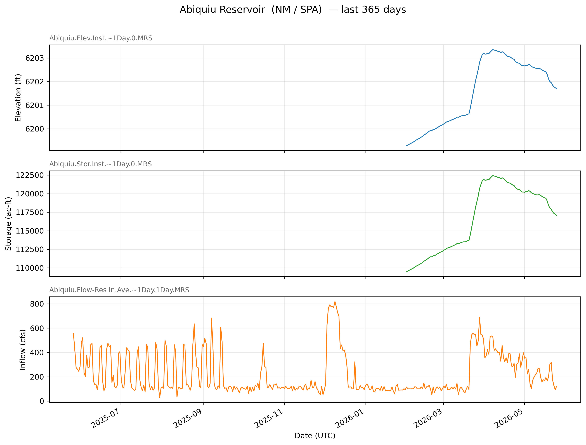
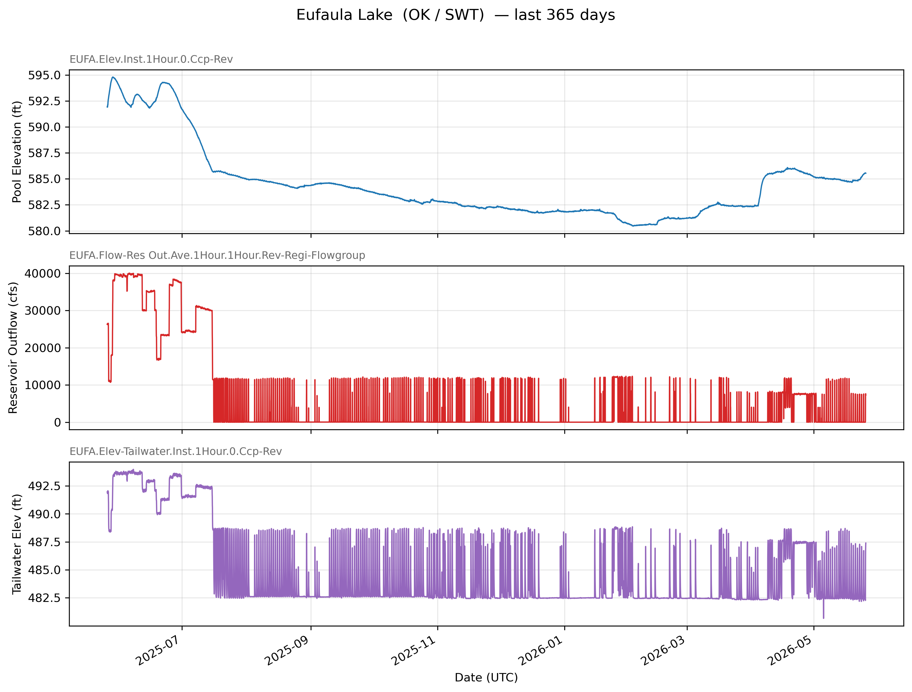
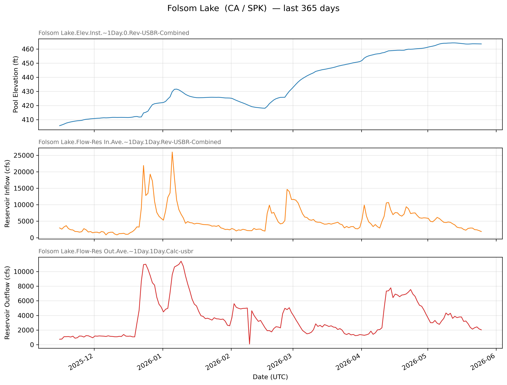
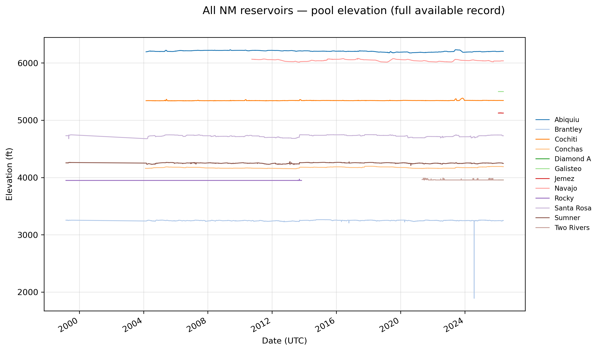

# cwms-reservoir-downloader

Download USACE reservoir data (locations + time series) for any U.S. state from the
[CWMS Data API (CDA)](https://cwms-data-api.readthedocs.io/latest). Built on top of
the official [`cwms-python`](https://github.com/HydrologicEngineeringCenter/cwms-python)
client and the [`cwms-data-api`](https://github.com/USACE/cwms-data-api) service.

The package ships with a built-in state → USACE district mapping, defaults to
**New Mexico (NM)** and the Albuquerque District (**SPA**), and writes one CSV
(or Parquet/JSON) per time series to disk along with a `reservoirs.csv` and
`timeseries_catalog.csv` manifest.

---

## Installation

### 1. Clone

```bash
git clone https://github.com/montimaj/cwms-reservoir-downloader.git
cd cwms-reservoir-downloader
```

### 2. Create the conda environment

```bash
conda env create -f environment.yml
conda activate cwms-reservoir-downloader
```

The environment installs Python 3.11, `pandas`, `pyarrow`, `requests`, and
`cwms-python` from PyPI, then `pip install -e .` makes the
`cwms-reservoir-downloader` CLI available on your `PATH`.

### Alternative: plain `pip`

```bash
python -m venv .venv
source .venv/bin/activate
pip install -e .
```

`pyarrow` is a required dependency, so `--format parquet` works out of the box.

### Optional extras

```bash
pip install -e ".[examples]"   # matplotlib, used by scripts in examples/
pip install -e ".[dev]"        # pytest, black, isort, mypy, matplotlib
```

---

## Authentication

Public CDA data at `https://cwms-data.usace.army.mil/cwms-data/` does **not**
require credentials — the default run is unauthenticated. Credentials are only
needed for private endpoints or write access.

When you do need them, there are two ways to pass an API key (and likewise for
an OIDC bearer token). Both ultimately call
[`cwms.init_session`](https://github.com/HydrologicEngineeringCenter/cwms-python),
which attaches `Authorization: apikey <KEY>` (or `Authorization: Bearer <TOKEN>`)
to every CDA request for the rest of the process.

### 1. Environment variable (recommended)

```bash
export CDA_API_KEY="your-api-key"
# or
export CDA_TOKEN="your-oidc-bearer-token"

cwms-reservoir-downloader --state NM
```

The CLI reads `CDA_API_KEY` / `CDA_TOKEN` as the default values for the
`--api-key` / `--token` flags, so nothing extra is needed on the command line.

### 2. Explicit flag

```bash
cwms-reservoir-downloader --state NM --api-key "your-api-key"
# or
cwms-reservoir-downloader --state NM --token   "your-oidc-bearer-token"
```

If both are supplied, `cwms-python` uses the token and logs a warning.

### From the library

```python
from cwms_reservoir_downloader import download_state

download_state(state="NM", ..., api_key="your-api-key")
# or
download_state(state="NM", ..., token="your-oidc-bearer-token")
```

`init_session` is called once at the start of `download_state` and mutates the
shared session — there is no per-request key plumbing.

---

## Quick start: download New Mexico

```bash
# 30 days of reservoir time series for every NM project location
cwms-reservoir-downloader --state NM -v
```

Output layout:

```
data/NM/
├── reservoirs.csv              # all discovered reservoir locations
├── timeseries_catalog.csv      # every time series ID seen for those locations
├── manifest.csv                # list of files actually written
└── SPA/<Location>/<Ts.Id>.csv  # one file per time series
```

### Custom date range

```bash
cwms-reservoir-downloader \
    --state NM \
    --begin 2024-01-01 \
    --end   2025-01-01 \
    --output-dir ./data \
    --format csv \
    -v
```

### List reservoir locations only (no time series)

```bash
cwms-reservoir-downloader --state NM --list-only
```

### Other states

```bash
# Override the state and let the built-in mapping pick the office(s)
cwms-reservoir-downloader --state OK --begin 2024-06-01 --end 2024-07-01

# Or specify offices manually
cwms-reservoir-downloader --state TX --office SWF --office SWG --office SWT

# Print the full state→office mapping
cwms-reservoir-downloader --list-offices
```

### Output formats

```bash
cwms-reservoir-downloader --state NM --format parquet
cwms-reservoir-downloader --state NM --format json
```

---

## Examples

Four end-to-end example scripts live under [examples/](examples/). The first
three each download a year of pool elevation, inflow, and outflow for one
major reservoir in a different USACE district and render multi-panel
matplotlib plots; they share a small helper
([examples/_plot_helpers.py](examples/_plot_helpers.py)) so each script reads
like configuration. The fourth covers **every reservoir in New Mexico**,
downloading the full available pool-elevation record per reservoir, writing
one CSV per reservoir to [examples/data/nm_elevations/](examples/data/nm_elevations/),
and rendering a single combined plot.

Install the extra and run any of them:

```bash
pip install -e ".[examples]"

python examples/01_new_mexico.py       # → examples/figures/nm_abiquiu.png
python examples/02_oklahoma.py         # → examples/figures/ok_eufaula.png
python examples/03_california.py       # → examples/figures/ca_folsom.png
python examples/04_new_mexico_all.py   # → examples/figures/nm_all_elevations.png
                                       #   + examples/data/nm_elevations/*.csv
```

### New Mexico — Abiquiu Reservoir (SPA)

Pool elevation, storage, and daily inflow for the past year.
Script: [examples/01_new_mexico.py](examples/01_new_mexico.py)



### Oklahoma — Eufaula Lake (SWT)

Pool elevation, reservoir outflow, and tailwater elevation (hourly).
Script: [examples/02_oklahoma.py](examples/02_oklahoma.py)



### California — Folsom Lake (SPK)

Pool elevation, reservoir inflow, and reservoir outflow (daily).
Script: [examples/03_california.py](examples/03_california.py)



### New Mexico — every reservoir, full elevation record (SPA)

Discovers every reservoir location in NM via the CWMS Data API, picks one
elevation series per reservoir (preferring the long-history `DCP-rev` district
SCADA feed when it exists, otherwise falling back to the daily `MRS` series),
downloads the entire available record, writes one CSV per reservoir to
[examples/data/nm_elevations/](examples/data/nm_elevations/), and overlays
every series on a single plot. See
[examples/README.md](examples/README.md#generated-csvs) for the per-reservoir
record-start dates.
Script: [examples/04_new_mexico_all.py](examples/04_new_mexico_all.py)



To plot a different reservoir, copy any of the first three scripts, change the
`state`, `office`, `location`, and `series` in the `ReservoirExample` block,
and rerun. Time series IDs can be discovered with
`cwms-reservoir-downloader --state <STATE> --list-only` followed by inspecting
`data/<STATE>/timeseries_catalog.csv`.

---

## CLI reference

```
cwms-reservoir-downloader --help
```

| Flag | Default | Description |
| --- | --- | --- |
| `--state` | `NM` | Two-letter U.S. state code. |
| `--office` | (from mapping) | USACE district office ID. Repeatable. |
| `--location-kind` | `PROJECT,EMBANKMENT,OUTLET,OVERFLOW,TURBINE,LOCK,GATE` | CWMS location-kind filter. Repeatable. |
| `--timeseries-group` | `None` | `timeseries-group-like` regex (set to `'DMZ Include List'` for the public subset). |
| `--begin` / `--end` | last 30 days (UTC) | ISO-8601 window. |
| `--output-dir` | `./data` | Root directory for outputs. |
| `--format` | `csv` | `csv`, `parquet`, or `json`. |
| `--unit-system` | `EN` | `EN` (English) or `SI`. |
| `--max-workers` | `20` | Parallel threads per series (intra-series chunk fetcher inside `cwms.get_timeseries`). |
| `--max-days-per-chunk` | `30` | Chunk size for parallel time-window splits. |
| `--max-catalog-workers` | `4` | Parallel per-location timeseries-catalog queries. Set to `1` for sequential. |
| `--max-download-workers` | `4` | Parallel per-timeseries downloads. Peak CDA concurrency is this × `--max-workers`. |
| `--api-root` | CDA prod | Override the CDA base URL. |
| `--api-key` / `--token` | env | `CDA_API_KEY` / `CDA_TOKEN` env vars also accepted. |
| `--list-only` | – | List reservoirs and exit. |
| `--list-offices` | – | Print the state→office mapping and exit. |
| `-v` / `-vv` | – | INFO / DEBUG logging. |

---

## Library usage

The CLI is a thin wrapper around three functions you can call from Python:

```python
from datetime import datetime, timezone
from pathlib import Path

from cwms_reservoir_downloader import download_state, list_reservoirs

reservoirs = list_reservoirs("NM")
print(reservoirs[["name", "office-id", "state-initial", "location-kind"]].head())

result = download_state(
    state="NM",
    begin=datetime(2024, 1, 1, tzinfo=timezone.utc),
    end=datetime(2024, 6, 1, tzinfo=timezone.utc),
    output_dir=Path("data"),
)
print(f"Wrote {len(result.downloaded)} files to {result.output_dir}")
```

---

## How it works

1. Resolve a list of USACE district offices for the requested state from
   [`config.OFFICES_BY_STATE`](src/cwms_reservoir_downloader/config.py).
2. Hit `GET /catalog/LOCATIONS` for each office, filtered by `location-kind-like`
   to reservoir-related kinds (`PROJECT`, `EMBANKMENT`, ...).
3. Filter the combined locations DataFrame by `state-initial == <state>` so we
   drop neighboring-state gauges that a district happens to own.
4. For each surviving location, hit `GET /catalog/TIMESERIES` with
   `like=<location>\..*` to enumerate every time series attached to it.
5. For each time series, call `cwms.get_timeseries` (chunked, multithreaded) and
   write the resulting DataFrame to disk.

The state → office table is conservative but not exhaustive — if you find a
state we missed, pass `--office` explicitly or extend `OFFICES_BY_STATE`.

---

## License

Apache 2.0 — see [LICENSE](LICENSE).
